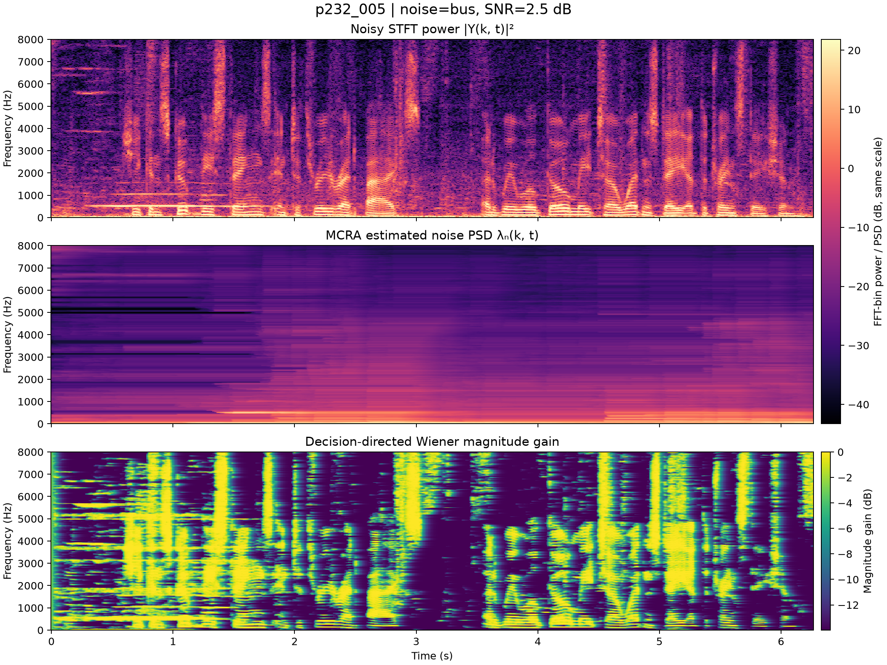
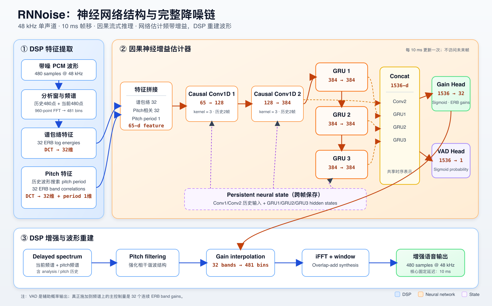

# 算法架构与实时工程

最后更新：2026-08-14

## 1. 两条正式路线

项目保留一条经典路线和一条预训练学习路线：

```text
16 kHz mono
  ├→ STFT → MCRA noise PSD → DD-Wiener gain → WOLA
  └→ 16→48 kHz FIR → official RNNoise → 48→16 kHz FIR
```

MCRA + DD-Wiener 更保守、可解释，适合作为 baseline 和 high-SNR/babble 参照；RNNoise
抑制更强、听感更好，是当前 Demo 路线，但存在过处理风险。

## 2. 经典增强

STFT 使用 `512`-sample frame、`128`-sample hop、`sqrt periodic Hann` 和 WOLA。
Identity 离线与任意 chunk 流式重建最大绝对误差均为 `1.665e-16`，先证明分析/合成链不会
自行改变信号。

MCRA 用平滑功率谱与局部最小值的比值估计 speech presence，并递归更新 noise PSD：

```math
R(k,m)=\frac{S(k,m)}{S_{min}(k,m)}
```

下图把 noisy STFT、MCRA 估计出的二维 noise PSD 与最终 Wiener gain 放在同一
时间/频率网格上。前两幅使用同一 dB 色标；如果某个结构在 noisy 图中很亮、但在 MCRA
noise PSD 中不够亮，滤波器就会低估该处噪声并保留它。第三幅中接近 `0 dB` 表示几乎
不衰减，接近 `-14 dB` 是当前 `gain_floor=0.20` 的最大幅度衰减。



该图是早期用于诊断金属结构噪声的 `p232_005` illustrative example，不参与当前以
speaker-disjoint validation 为主的冻结性能结论。

DD-Wiener 用上一帧估计稳定当前 priori SNR：

```math
\xi_t=\alpha_{dd}G_{t-1}^{2}\gamma_{t-1}
+(1-\alpha_{dd})\max(\gamma_t-1,0),\qquad
G_t=\frac{\xi_t}{1+\xi_t}
```

冻结参数：

| 参数 | 数值 |
|---|---:|
| `alpha_s / alpha_p / alpha_d` | `0.80 / 0.20 / 0.95` |
| `minimum_window_frames` | `125`，约 1 s |
| `ratio_threshold` | `5.0` |
| `alpha_dd` | `0.92` |
| `gain_floor` | `0.20`，最大幅度衰减约 14 dB |
| gain decrease/increase smoothing | `0.70 / 0.40` |

经典路线的主要失败不是 WOLA 或 Wiener 公式，而是结构噪声下的 noise PSD/SPP 判别。固定
样本 `p232_005` 的 Oracle Wiener 使用真实 clean/noise 后达到 `+16.08 dB SI-SDRi`，证明
STFT mask 有表达能力；现实 MCRA/IMCRA 把持续结构噪声误判为应保护成分。

## 3. RNNoise 架构



RNNoise 不是直接生成干净波形，而是“DSP 特征与合成 + 神经增益估计器”：

```text
480 个新样本 @48 kHz
→ 960 点分析窗和 FFT
→ 32 个 ERB band energies
→ pitch search/correlation
→ 65 维特征
→ 2 层 causal Conv1D + 3 层 GRU
→ 32 个 band gains + 1 个 VAD probability
→ pitch filtering、频带增益、iFFT 和 overlap-add
```

| 项目 | 数值 |
|---|---:|
| 采样率 | `48 kHz` |
| 帧移 / 分析窗 | `480/960 samples`，即 `10/20 ms` |
| FFT bins / ERB bands | `481 / 32` |
| 输入特征 | `32` 谱包络 cepstrum + `32` pitch correlation cepstrum + `1` pitch period |
| 网络主干 | `65→128→384` causal Conv1D，随后 `3×384` GRU |
| 输出 | `32` 连续 band gains + `1` VAD probability |

神经网络、特征、层数和权重来自 official RNNoise。本项目不重新训练它。VAD 是辅助输出，
不直接 hard mute；32 个 gain 会插值回 481 个频率 bin。

## 4. Python/C 幅值契约

项目内部统一使用 `[-1,1]` normalized float，而 RNNoise C API 的 `float*` 数值按 16-bit
PCM magnitude 使用：

```text
normalized float
→ ×32767、round、int16
→ float32 PCM magnitude
→ rnnoise_process_frame()
→ ÷32767
→ normalized float32
```

直接把 `0.1` 量级 normalized audio 传入 C API 会造成约 90 dB 的尺度错误。接口因此严格
拒绝非有限值、越界、非单声道和非 480-sample frame。

## 5. Persistent state 与任意 chunk

连续音频流只创建一次 `DenoiseState`。它保存 Conv/GRU 状态、pitch history、analysis/
synthesis overlap、delayed spectrum 和上一帧 gain。每帧重建 state 会改变算法本身，不只是
降低速度。

外部 chunk 可以是 `1/127/137/480/1000/...` 任意长度。wrapper 在内部缓冲为 480-sample
frame；同一波形整段输入和任意切块输入必须逐样本一致。`flush()` 处理尾部并保持输出总长度，
`reset()` 开始新流，`close()` 释放 native state。

主要实现：

```text
src/speech_frontend/rnnoise/backend.py
src/speech_frontend/rnnoise/streaming.py
src/speech_frontend/rnnoise/resampler.py
```

## 6. 16↔48 kHz 与延迟

VoiceBank 和 Whisper 使用 16 kHz，RNNoise 固定为 48 kHz。项目使用状态化 3× FIR：

| 参数 | 数值 |
|---|---:|
| FIR taps | `127` |
| cutoff | `7,800 Hz` |
| window | Kaiser `β=8.6` |
| RNNoise core delay | `160 samples @16k = 10 ms` |
| 两段 FIR delay | `42 samples @16k = 2.625 ms` |
| 总固定延迟 | `202 samples @16k = 12.625 ms` |

实时系统不能消除因果延迟，只能向下游报告 timestamp offset。离线 paired evaluation 必须
前移 202 samples；早期遗漏 RNNoise 一帧延迟曾使 mean SI-SDRi 错误地变成 `-28.109 dB`。

算法延迟与处理耗时不同：前者由未来样本依赖决定，后者由 CPU 性能决定。

## 7. 实验路线为何收敛到 R3

| 路线 | 得到的证据 | 决策 |
|---|---|---|
| Identity | STFT/WOLA 和 streaming 正确 | 保留为硬门槛 |
| Spectral subtraction | 有基础降噪但 musical noise 风险高 | 教学 baseline |
| MCRA + instantaneous/DD-Wiener | 可获得正 SI-SDRi，结构噪声残留 | 保留 DD-Wiener |
| gain 平滑/startup ramp | 没有消除关键金属噪声 | 否决该根因 |
| MCRA/IMCRA + OM-LSA | 更复杂 estimator 仍误保护结构噪声 | 负结果 |
| Oracle Wiener | mask 有能力，estimator 才是瓶颈 | 支持转向学习判别 |
| RNNoise R3 | 第一个通过固定试听门槛的实时方案 | 默认 Demo |
| R4 noisy residual mixing | 指标改善但把金属噪声混回 | 关闭 |
| C1 output-only boost | 无法恢复已删除音素，未超过 R3 | 仅试听消融 |

## 8. 工业边界

平均 `RTF<1` 不保证每个声卡 callback 都不超时；完整部署还需检查 callback deadline、队列、
长时间内存、掉块、线程优先级和设备切换。

单通道增强也不能替代：

- AEC：需要扬声器 reference；
- beamforming：需要多麦克风几何；
- target speaker extraction：需要目标身份或空间条件；
- dereverberation：处理房间反射；
- AGC/limiter：管理响度和 clipping。

尤其 babble 不是普通非语音噪声。没有目标 speaker 条件的单通道 RNNoise 无法稳定判断应保留
哪一个人声。
