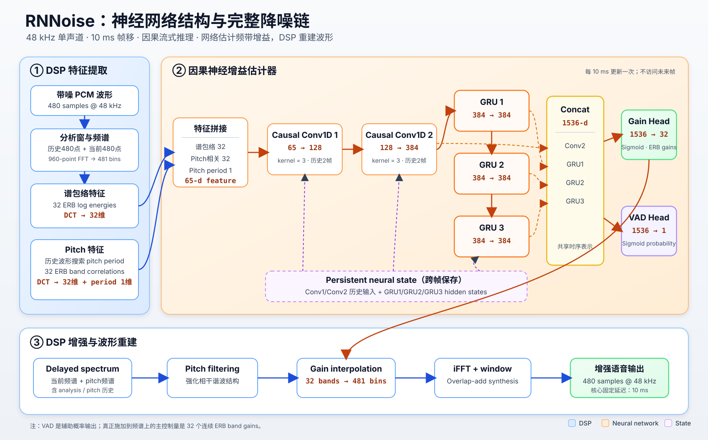

# RNNoise 模型架构

最后更新：2026-07-31

## 1. RNNoise 在系统中的作用

RNNoise 是一个将传统数字信号处理（DSP）与神经网络结合的单通道语音降噪系统。它并不
直接从时域波形生成一段全新的语音，而是在频域中估计每个听觉频带应保留多少能量，再由
DSP 完成滤波和波形重建。

它在本项目中的输入和输出是：

```text
输入：48 kHz、单声道、带噪 PCM 波形
  ↓
DSP 提取频谱、听觉频带和基音特征
  ↓
神经网络估计 32 个频带增益和 1 个 VAD 概率
  ↓
DSP 执行 pitch filtering、频域增益和波形重建
  ↓
输出：48 kHz、单声道、增强波形
```

这里的神经网络承担最难用固定公式描述的“语音与噪声判别”，但整个系统仍有大量确定性的
DSP 模块。因此更准确的理解是：

> RNNoise 是一个以神经网络作为增益估计器的混合式实时语音增强系统。

---

## 2. 一帧处理规格

RNNoise 内部使用固定的 48 kHz 采样率，每次 API 调用接收 480 个新样本：

| 项目 | 数值 | 含义 |
|---|---:|---|
| 采样率 | 48,000 Hz | 每秒 48,000 个采样点 |
| 帧移 | 480 samples | 每 10 ms 处理一次 |
| 分析窗 | 960 samples | 当前 480 点与历史 480 点组成 20 ms 分析窗 |
| FFT 点数 | 960 | 实信号得到 481 个非负频率 bin |
| ERB 频带数 | 32 | 将 481 个频率 bin 压缩为 32 个听觉频带 |
| 输入特征数 | 65 | `32 + 32 + 1` |
| 增益输出数 | 32 | 每个 ERB 频带一个连续增益 |
| VAD 输出数 | 1 | 当前帧的语音存在概率 |

需要区分两个时间尺度：

- **10 ms 帧移**决定系统多久接收一次新输入并更新一次网络状态；
- **20 ms 分析窗**决定一次频谱分析能看到多长的局部波形。

分析窗长于帧移并不意味着每次都等待全新的 20 ms。相邻帧共享一半波形，通过重叠分析和
重叠相加连续工作。

### 2.1 PCM 幅值契约

RNNoise C API 的缓冲区类型虽然是 `float*`，但数值尺度按 16-bit PCM 使用，而不是
`[-1, 1]` 归一化浮点音频。本项目在 Python 边界显式转换：

```text
[-1, 1] normalized float
→ 四舍五入并乘以 32767
→ 16-bit PCM magnitude 的 float buffer
→ RNNoise C API
→ 除以 32767
→ [-1, 1] normalized float
```

如果直接把幅度约为 `0.1` 的归一化音频传给 C API，网络所看到的能量尺度会小约
90 dB，特征与训练时的分布不一致，输出将失去意义。

---

## 3. 完整信号处理流程

```text
当前 480 个样本
  │
  ├─ 1. 因果高通滤波
  │
  ├─ 2. 与历史 480 点组成 960 点分析窗
  │
  ├─ 3. 加窗和 960 点 FFT，得到 481 个复数频谱 bin
  │
  ├─ 4. 聚合为 32 个 ERB 频带能量
  │
  ├─ 5. 在历史波形中搜索 pitch period
  │
  ├─ 6. 计算带噪频谱与 pitch-delayed 频谱的频带相关性
  │
  ├─ 7. 组成 65 维特征
  │
  ├─ 8. 两层 causal Conv1D + 三层 GRU
  │
  ├─ 9. 输出 32 个 band gains 和 1 个 VAD probability
  │
  ├─ 10. 对延迟频谱执行 pitch filtering
  │
  ├─ 11. 将 32 个 gain 插值回 481 个 FFT bins
  │
  └─ 12. iFFT + overlap-add，输出上一帧的增强波形
```

最后一步作用于保存的 delayed spectrum，因此音频输出相对于输入存在一帧固定延迟。延迟
细节见《04_实时工程实现与测试》。

---

## 4. 32 个 ERB 听觉频带

### 4.1 为什么不直接预测 481 个 FFT bin

人耳对频率的分辨率并不是线性的：低频区域能分辨较细的频率差异，高频区域的听觉带宽更
宽。ERB（Equivalent Rectangular Bandwidth，等效矩形带宽）是一种近似这种听觉分辨率的
频率尺度。

RNNoise 将 481 个非负频率 bin 聚合成 32 个 ERB 频带：

- 低频带较窄，更精细地保留基频和低阶谐波；
- 高频带较宽，减少不必要的输出维度；
- 相邻 bin 通过线性权重分配给相邻频带，避免硬边界。

网络只需预测 32 个增益，而不是 481 个逐 bin 掩码。这样设计有三个主要原因：

1. **计算量更低**：输出层和后续处理维度明显减小；
2. **增益更平滑**：相邻频率不容易出现大量孤立的开关式抑制；
3. **更符合听觉感知**：模型把能力集中在人耳更敏感的频带分辨率上。

代价是频率分辨率变粗。对于很窄的纯音噪声或精细谐波干扰，32-band gain 不如逐 bin
mask 灵活。

### 4.2 从 FFT bin 到频带，再返回 FFT bin

分析阶段将 FFT 功率谱按权重累计为 32 个 band energies。合成阶段使用相同的频带边界，
把网络预测的 32 个 gain 插值回 481 个 FFT bins：

```text
481-bin spectrum
→ 32-band features
→ neural network
→ 32-band gains
→ 481-bin interpolated gains
→ enhanced spectrum
```

这种低维估计与高维合成的组合，是 RNNoise 兼顾实时性和音质的重要设计。

---

## 5. 65 维输入特征

神经网络每 10 ms 接收一个 65 维向量：

```text
features[0:32]   32 维频谱包络 cepstrum
features[32:64]  32 维 pitch correlation cepstrum
features[64]      1 维归一化 pitch period
```

### 5.1 前 32 维：频谱包络 cepstrum

处理步骤是：

1. 计算当前带噪频谱的 32 个 ERB band energies；
2. 对能量取对数并限制动态范围；
3. 对 32 维 log-band energy 做 DCT；
4. 得到 32 维 spectral cepstrum。

对数能量把乘性的幅值差异转化为更容易建模的加性差异，DCT 则把频带之间平滑变化的谱包络
表示得更紧凑。它主要告诉网络：

- 当前声音的整体谱形是什么；
- 能量集中在哪些频段；
- 谱包络是否像元音、辅音或某类噪声。

“Cepstrum”不是另一段声音，而是对对数频谱做变换后的特征表示。

### 5.2 中间 32 维：pitch correlation cepstrum

仅凭谱能量很难区分有谐波结构的语音和有结构的噪声。RNNoise 还会：

1. 在历史 pitch buffer 中搜索基音周期；
2. 取得相应的 pitch-delayed 波形并计算其频谱；
3. 在 32 个 ERB band 上计算当前频谱与 pitch spectrum 的归一化相关性；
4. 对 32 维相关性做 DCT。

这些特征描述当前信号在不同频带上的周期性：

- 浊音通常具有稳定的基频和谐波结构；
- 宽带随机噪声通常与 pitch-delayed 信号的相关性较低；
- 网络可将“能量大小”和“是否具有语音周期性”结合判断。

它不是简单地把“有 pitch”等同于“有人声”，而是给神经网络提供一个有物理意义的先验。

### 5.3 最后 1 维：pitch period

最后一维是归一化后的 pitch period：

```text
0.01 × (pitch_index - 300)
```

它让网络直接知道当前估计的周期长度。相同的频谱相关性在不同 pitch period 下可能代表
不同的语音状态，因此这一标量能补充 32 维相关性特征。

---

## 6. 神经网络结构



上图将神经网络主干与前后的确定性 DSP 链路分开显示。橙色区域是预训练神经网络，蓝色
区域负责声学特征提取和波形重建，虚线框表示必须跨 10 ms 帧持续保存的神经网络状态。

网络可以概括为：

```text
65-d feature
  ↓
Causal Conv1D: 65 → 128
  ↓
Causal Conv1D: 128 → 384
  ↓
GRU 1: 384 → 384
  ↓
GRU 2: 384 → 384
  ↓
GRU 3: 384 → 384
  ↓
concat(conv2, gru1, gru2, gru3)
  ↓
1536-d shared representation
  ├─ sigmoid head → 32 band gains
  └─ sigmoid head → 1 VAD probability
```

两层卷积各保存两个历史时刻的输入状态，因此只使用当前及过去信息，不访问未来帧。三层
GRU 每层有 384 个隐藏单元，其 hidden state 同样跨帧保存。

### 6.1 两层因果 Conv1D 的作用

因果卷积首先提取短时间范围内的局部变化，例如：

- 某些频带能量正在上升还是下降；
- pitch correlation 是否在连续几帧中稳定；
- 当前特征变化更像音素过渡还是短促噪声。

“因果”表示输出只依赖当前帧和历史帧，不依赖未来帧，因此可以在线处理。若使用对称卷积
查看未来帧，离线效果可能更好，但必须等待未来音频，会增加不可忽略的 look-ahead 延迟。

### 6.2 三层 GRU 的作用

GRU（Gated Recurrent Unit，门控循环单元）通过 hidden state 建模更长的时间上下文。
它比只看当前帧的统计增益估计多出以下能力：

- 利用连续音素和说话节奏判断弱语音；
- 跟踪相对稳定或逐渐变化的背景噪声；
- 结合多帧 pitch 连续性区分浊音与结构噪声；
- 避免增益完全随单帧能量剧烈跳变。

三层 GRU 不是三个互不相关的分类器，而是逐层形成更高层次的时序表示。网络将第二层卷积
输出和三层 GRU 状态全部拼接为 1536 维表示，再同时预测增益与 VAD。

### 6.3 为什么使用 GRU

与简单 RNN 相比，GRU 的更新门和重置门能控制历史信息保留多久，缓解长序列训练中的梯度
问题；与更大的序列模型相比，GRU 的状态尺寸固定，逐帧计算路径明确，更适合低延迟流式
推理。

这里的关键并不是“GRU 一定优于所有网络”，而是它在时序建模能力、状态大小、计算量和
因果推理之间取得了适合实时降噪的平衡。

---

## 7. 两个输出头

### 7.1 32 个 band gains

主输出是 32 个位于 `[0, 1]` 的连续频带增益：

- 接近 `1`：该频带主要被保留；
- 接近 `0`：该频带被强烈抑制；
- 中间值：在降噪与保留语音之间连续折中。

增益不是“这个频带是否有人声”的硬分类。一个频带可以同时含有语音和噪声，连续增益允许
网络表达“保留一部分”的软掩码。

在应用前，频带增益被插值到 FFT bins。实现还限制增益的帧间下降速度：

```text
current_gain = max(current_gain, 0.6 × previous_gain)
```

这能降低增益突然塌陷带来的时域断裂和强烈伪影，但也意味着突发噪声不一定能在一帧内被
完全压低。

### 7.2 1 个 VAD probability

辅助输出是 `[0, 1]` 范围内的语音活动概率。它表达神经网络对当前特征中存在语音的置信度。

RNNoise 主降噪链不会把 VAD 当成硬开关；真正施加在频谱上的是 32 个连续 band gains。
这样可避免 VAD 阈值附近发生整帧突然开关。

还要注意时序关系：API 返回的 VAD 来自当前输入帧，而音频合成作用于 delayed spectrum。
如果后续控制器要用 VAD 调节已输出音频，必须显式处理这一帧对应关系。

### 7.3 为什么采用多任务输出

band gains 和 VAD 都需要理解“当前是否存在语音”，二者共享卷积和 GRU 表示可以：

- 让 VAD 任务为共享表示提供额外监督；
- 让增益估计学习更稳定的语音存在信息；
- 只增加很小的输出层开销。

---

## 8. Pitch filtering

网络输出增益后，系统不会立即把它乘到频谱上，而会先进行 pitch filtering。该模块综合：

- 当前带噪频谱；
- pitch-delayed 频谱；
- 两者在各频带的相关性；
- 网络预测的 band gains。

它会将一定比例的 pitch-delayed spectrum 加入待增强频谱，并重新归一化各频带能量。
其主要作用是：

- 加强浊音的谐波峰；
- 降低谐波峰之间的噪声；
- 使用显式周期结构辅助神经网络。

这不是从无到有地合成语音，而是利用历史波形中与当前语音相干的周期成分。若 pitch period
估计错误，也可能改变音色或强化错误的谐波，因此它是一种有明确收益和风险的先验。

---

## 9. 频域合成与固定一帧延迟

合成阶段执行：

```text
pitch-filtered delayed spectrum
→ 32 个增益插值为 481 个 bin 增益
→ 频谱逐 bin 相乘
→ inverse FFT
→ synthesis window
→ overlap-add
→ 480 个输出样本
```

处理当前帧时，网络使用当前特征更新状态，但滤波和合成作用于保存的上一帧频谱。因此：

```text
第 t 次调用的输入：第 t 帧
第 t 次调用的特征：第 t 帧
第 t 次调用的音频：第 t-1 帧
```

这形成 480 samples，也就是 48 kHz 下 10 ms 的核心算法延迟。它不是运行速度慢造成的，
也不能通过提高 CPU 性能消失，而是算法数据依赖的一部分。

---

## 10. DSP 与神经网络的职责边界

| 环节 | DSP 负责 | 神经网络负责 |
|---|---|---|
| 时域预处理 | 高通、历史缓存、加窗 | — |
| 频域分析 | FFT、ERB band energies | — |
| 周期分析 | pitch search、相关性计算 | — |
| 特征表示 | log energy、DCT、归一化 | — |
| 时频判别 | — | 结合特征与历史判断语音/噪声模式 |
| 增益估计 | — | 输出 32 个连续 band gains |
| 语音活动估计 | — | 输出 VAD probability |
| 语音谐波增强 | pitch filtering | 增益参与决定 filter strength |
| 波形重建 | gain interpolation、iFFT、overlap-add | — |

这个分工解释了为什么 RNNoise 不是一个纯神经波形生成器：

- DSP 提供结构清楚、计算高效的声学表示和可逆合成链；
- 神经网络处理经典统计模型最难解决的 speech/noise 判别；
- 低维连续增益限制网络输出空间，降低实时计算量和不稳定风险。

---

## 11. 为什么这种架构适合实时语音增强

### 11.1 固定大小、因果状态

每 10 ms 处理一次固定大小帧，Conv 和 GRU 只保存有限状态，不需要缓存整段录音，也不需要
等待未来帧。

### 11.2 低维听觉表示

把 481 个 FFT bins 压缩为 32 个 ERB bands，使网络输入和输出都远小于逐 bin 方案。

### 11.3 显式利用语音先验

Pitch search 和 pitch correlation 将浊音周期性直接提供给网络，网络不必仅从能量中重新
学习全部声学规律。

### 11.4 学习估计与确定性合成分离

网络估计“保留多少”，DSP 负责“如何得到合法波形”。这种结构便于分析延迟、状态和
clipping，也比完全黑盒的时域生成模型更容易集成到实时前端。

### 11.5 设计代价

这种设计也带来限制：

- 32-band 表示可能漏掉很窄的频谱结构；
- 因果模型无法利用未来上下文；
- 强抑制时可能把弱辅音或低能量语音一起压低；
- pitch 估计错误可能改变谐波结构；
- 输出是增强后的语音，不是理想无失真的 clean speech。

这些代价与项目试听中观察到的“结构噪声抑制较好，但部分语音略有断续”是一致的。

---

## 12. 面试快速回答

### 问：RNNoise 的神经网络输入和输出是什么？

输入是每 10 ms 提取一次的 65 维特征，包括 32 维频谱包络 cepstrum、32 维 pitch
correlation cepstrum 和 1 维 pitch period。网络输出 32 个 ERB 频带增益和 1 个 VAD
概率，不直接输出时域波形。

### 问：为什么需要 Conv1D 和 GRU？

因果 Conv1D 建模几帧内的局部变化，GRU 通过跨帧 hidden state 建模更长的语音和噪声
演化。二者都不访问未来帧，因此适合实时处理。

### 问：为什么只输出 32 个增益？

32 个 ERB bands 接近人耳的非线性频率分辨率，能降低网络输出维度，并使频率增益更平滑。
之后再将增益插值回 481 个 FFT bins 完成合成。

### 问：VAD 是否直接控制降噪开关？

不是。VAD 是一个辅助概率输出，主降噪由 32 个连续 band gains 完成。把 VAD 作为硬开关
容易在阈值附近造成整帧突变。

### 问：RNNoise 为什么比 MCRA + Wiener 更可能处理结构噪声？

MCRA 主要依赖局部谱最小值和统计平滑，持续、有谱结构的噪声可能被误判为语音。RNNoise
同时使用频谱、pitch correlation 和跨帧 GRU 状态，能从数据中学习更复杂的语音与噪声
时序模式。

### 问：这个架构的核心创新是否只有神经网络？

不是。它的价值来自听觉频带表示、pitch 先验、因果时序网络、低维增益目标和确定性频域
合成的协同设计。只把它描述成“三层 GRU”会遗漏大量声学与实时系统设计。
