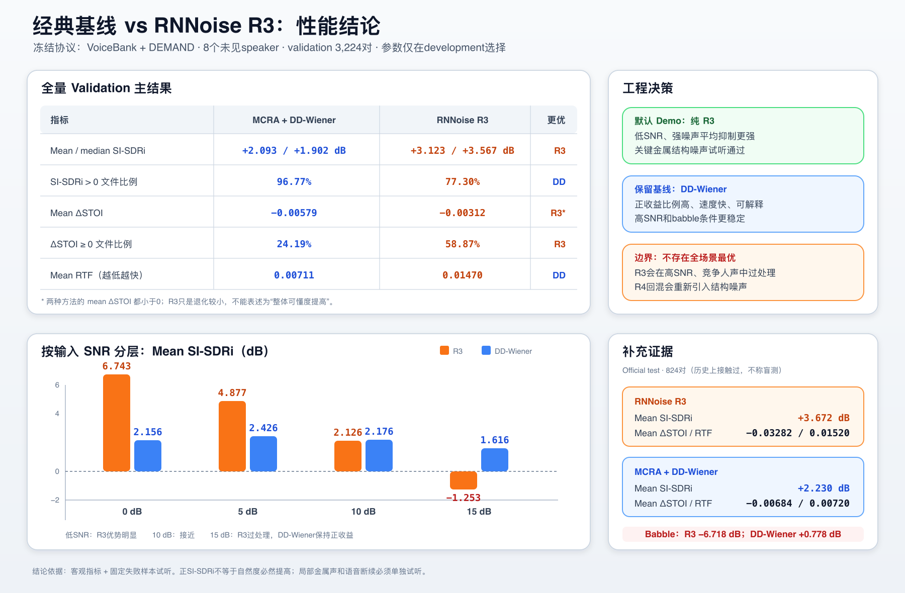
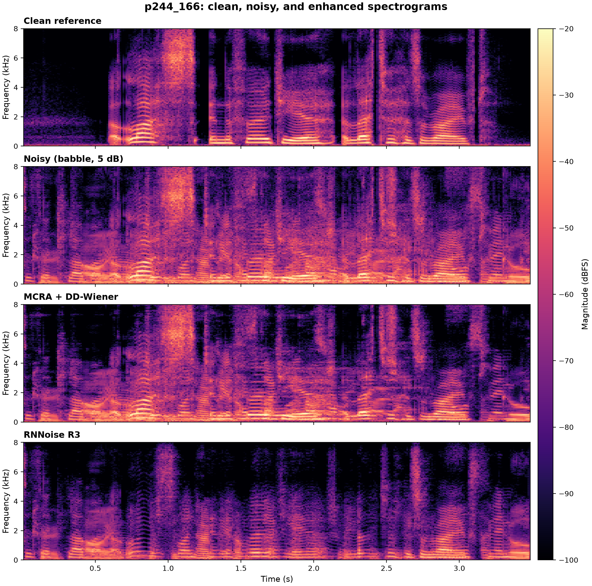

# 实验结果与 ASR 分析

最后更新：2026-08-14

## 1. 先区分两种完成度

| 任务 | 当前规模 | 状态 | 能否作为最终结论 |
|---|---:|---|---|
| 增强 validation | 3,224 对、8 个未见 speaker | 完成 | 是，当前主要增强证据 |
| 增强 official test | 824 对、2 个 speaker | 完成 | 补充；历史接触过 |
| ASR balanced | 100 utterances × 4 路 = 400 输入 | 完成 | 只作管线验收和问题定位 |
| ASR validation stratified | 320 × 4 = 1,280 输入；8 speaker × 10 noise × 4 SNR | 完成 | 当前固定后端主验证证据 |
| ASR development full | 8,348 × 4 = 33,392 输入 | 未运行 | 否 |
| ASR validation full | 3,224 × 4 = 12,896 输入 | 未运行 | 否 |
| ASR official test | 824 × 4 = 3,296 输入 | 未运行 | 否 |

因此“RNNoise 的增强全量结果”已经成立；对固定 Whisper 的方向性结论也已在 320 条未见
speaker 分层样本上通过预设稳定性检查。它不是 validation full 的自然分布精确估计，也不能
外推到所有 ASR 后端。

## 2. 增强主结论



### 2.1 未见 speaker validation

| 方法 | Mean/median SI-SDRi | Positive SI-SDRi | Mean ΔSTOI | Nonnegative ΔSTOI | Mean RTF |
|---|---:|---:|---:|---:|---:|
| RNNoise R3 | `+3.123/+3.567 dB` | `77.30%` | `-0.00312` | `58.87%` | `0.01470` |
| MCRA + DD-Wiener | `+2.093/+1.902 dB` | `96.77%` | `-0.00579` | `24.19%` | `0.00711` |

RNNoise 的 mean SI-SDRi 95% bootstrap CI 为 `[2.925,3.314] dB`。它平均抑制更强；
DD-Wiener 平均提升较小，但更多文件保持正 SI-SDRi。两者 mean ΔSTOI 都为负，不能宣称
整体提高可懂度。

### 2.2 official test 补充结果

| 方法 | Mean/median SI-SDRi | Positive SI-SDRi | Mean ΔSTOI | Mean RTF |
|---|---:|---:|---:|---:|
| RNNoise R3 | `+3.672/+3.652 dB` | `75.24%` | `-0.03282` | `0.01520` |
| MCRA + DD-Wiener | `+2.230/+2.000 dB` | `95.87%` | `-0.00684` | `0.00720` |

这些数字不包装成完全盲测 benchmark，因为早期使用过 official test 样本试听和选路线。

### 2.3 条件化结果

Validation 的 SNR 分层：

| SNR | RNNoise SI-SDRi | RNNoise ΔSTOI | DD-Wiener SI-SDRi |
|---:|---:|---:|---:|
| 0 dB | `+6.743` | `+0.0226` | `+2.156` |
| 5 dB | `+4.877` | `+0.00145` | `+2.426` |
| 10 dB | `+2.126` | `-0.0132` | `+2.176` |
| 15 dB | `-1.253` | `-0.0233` | `+1.616` |

Babble 是明确失败条件：RNNoise mean SI-SDRi `-6.718 dB`，DD-Wiener 为 `+0.778 dB`。
结论不是“R3 全场景最优”，而是：

- R3 适合低 SNR、非语音型强噪声和默认听感 Demo；
- DD-Wiener 是 high-SNR/babble 的保守 baseline；
- 真实系统不能用数据集的真值 noise/SNR 标签做旁路；
- R4 broadband noisy mixing 会重新引入结构噪声，保持关闭；
- C1 不能恢复已删除的音素，只保留为负消融。

## 3. ASR 研究问题与冻结 v1

主问题是：

> 在不微调 ASR、模型权重和解码配置完全一致时，语音增强是否改善固定 Whisper
> `small.en` 的标准化 corpus WER？

四路输入按 utterance 严格配对：`clean/noisy/mcra_dd_wiener/rnnoise_r3`。reference 来自
人工 VCTK transcript，不使用 clean ASR 伪标签。v1 固定为：

```text
openai-whisper == 20250625
small.en，权重 SHA-256 固定
CPU + FP32
language=en，task=transcribe
temperature=0.0 only
beam_size=5，patience=1.0
condition_on_previous_text=false
compression/logprob/no-speech 阈值保留，但不做 temperature fallback
```

本机 MPS probe 与 CPU 的 normalized hypothesis 不一致，因此 v1 正式运行只接受 CPU。

## 4. balanced 100 条 ASR 结果

该子集为 20 个 development speaker、每人 5 条，共 744 个 reference words：

| Condition | S / D / I | WER | 相对 noisy | paired bootstrap 95% CI |
|---|---:|---:|---:|---:|
| clean | `14 / 0 / 3` | `2.28%` | `-3.36 pp` | `[-5.92,-1.19] pp` |
| noisy | `30 / 3 / 9` | `5.65%` | `0.00 pp` | `[0,0] pp` |
| MCRA + DD-Wiener | `29 / 3 / 9` | `5.51%` | `-0.13 pp` | `[-1.08,0.93] pp` |
| RNNoise R3 v1 | `73 / 20 / 212` | `40.99%` | `+35.35 pp` | `[5.16,91.43] pp` |

这些数值支持：

1. MCRA 只少一个词错误，区间跨零；当前只能说与 noisy 基本持平。
2. RNNoise 明显损害该固定后端，但 40.99% 被一个极端样本放大。
3. 排除 `p244_166` 后，RNNoise/noisy 仍为 `15.12%/5.72%`，所以不是单个离群值造成的全部
   退化。
4. 感知指标、听感和 WER 衡量不同目标，必须并行报告。

## 5. `p244_166`：过抑制如何变成重复解码



该样本为 `babble / 5 dB / 3.496 s`。RNNoise 时频图中目标语音的辅音、共振峰过渡和后半段
连续性明显被削弱，与人工试听“人声快被削没、后半段模糊”一致。

固定 beam search 输出 195 词，其中 185 个 insertion；compression ratio 为 `17.88`，
ASR RTF 为 `6.196`。音频长度、16 kHz、文件 SHA、延迟补偿和缓存均正常。

机制是：残缺声学证据不足以持续约束自回归 decoder；beam 一旦进入局部高概率重复前缀，
后续 token 更受已生成文本驱动。`condition_on_previous_text=false` 只能阻止跨 segment 历史，
不能阻止单个 segment 内循环。最终接近 224-token sample limit，形成大量 insertion 和计算长尾。

balanced 分层表明 babble 和低 SNR 都有影响：babble 9 条中 7 条 RNNoise WER 变差、没有
一条变好；非 babble 的 0–5 dB 也从 noisy `8.75%` 上升到 RNNoise `16.25%`。两者交互时
最容易出现灾难性重复。后续 validation 分层实验进一步检验了系统性。

## 6. validation 分层 320 条主验证

冻结 seed `20260724` 后，从每个 `speaker×noise×SNR` stratum 确定性抽 1 条：8 个未见
speaker、10 种 noise、4 个 SNR，共 320 utterances、2,555 个 reference words。四路均完整
运行，v1 结果为：

| Condition | S / D / I | WER | 相对 paired noisy | paired bootstrap 95% CI |
|---|---:|---:|---:|---:|
| clean | `27 / 4 / 9` | `1.57%` | `-4.42 pp` | — |
| noisy | `98 / 16 / 39` | `5.99%` | `0.00 pp` | — |
| MCRA + DD-Wiener | `115 / 32 / 21` | `6.58%` | `+0.59 pp` | `[-0.81,+1.87] pp` |
| RNNoise R3 v1 | `204 / 88 / 81` | `14.60%` | `+8.61 pp` | `[+5.90,+11.55] pp` |

RNNoise v1 只有 1 条 high-compression 解码异常，因此总体退化不再由重复输出离群点支配。
稳定性结果为：

- 8/8 个 speaker 的 RNNoise WER 都高于各自 paired noisy；
- leave-one-speaker-out 8 次全部保持同方向；
- 去掉影响最大的 `p226_001 / babble / 15 dB` 后，差值仍为 `+7.88 pp`；
- babble 差值为 `+47.67 pp`，非 babble 仍为 `+4.22 pp`；
- bootstrap 区间完全高于零。

所以低 SNR 不是唯一原因，babble 也不是唯一原因：babble 会显著放大问题，但在非 babble
条件下 RNNoise 仍系统性损害该固定后端。上述检查满足当前最小计算停止条件，不继续扩到 640
或 full。MCRA 的区间跨零；虽然 6/8 speaker 更差，但现有证据只能说“没有证明优于 noisy”，
不能宣称等价或必然更差。

## 7. v2 灾难保护

### 7.1 development balanced 诊断

v2 不覆盖 v1，也不读取人工 reference 做运行时决策：

```text
v1 首次结果
  ├─ 正常 → 接受
  └─ 异常 → temperature 0.2 → 0.4 → 0.6，固定 seed、best_of=5
               ├─ 重试通过且与 paired noisy 假设词距离 ≤0.4 → 接受
               ├─ 否则 enhanced condition 回退 noisy
               └─ 无安全结果 → abstain
```

检测信号包括 compression ratio、平均 log probability、重复 4-gram、word rate、token limit
和 no-speech/text 冲突。timestamp 检查会把 Whisper 的粗粒度短音频 segment end 大量误判，
因此冻结配置关闭该项。

| 路线 | RNNoise S / D / I | WER | 相对 noisy |
|---|---:|---:|---:|
| v1 固定解码 | `73 / 20 / 212` | `40.99%` | `+35.35 pp` |
| 只取首个形状正常的 temperature retry | `67 / 26 / 27` | `16.13%` | `+10.48 pp` |
| v2 完整策略 | `62 / 16 / 27` | `14.11%` | `+8.47 pp` |
| paired noisy | `30 / 3 / 9` | `5.65%` | `0 pp` |
| condition/noisy reference oracle | `24 / 6 / 4` | `4.57%` | `-1.08 pp` |

v2 修复了 `p231_046` 和 `p244_166` 两个触发样本，均回退 noisy。它相对 RNNoise v1 减少
65.57% 错误，但 `v2-noisy` 95% CI 仍为 `[3.47,14.35] pp`，不能称优于 noisy。

这里的 oracle 不是 clean ASR。它使用人工 reference，逐 utterance 事后选择 RNNoise/noisy
两路中词错误更少者，因此不可部署。balanced 子集上的 `4.57%` 只说明 RNNoise 在部分样本上
有条件价值；是否值得设计 router 必须由规模更大、离群点不主导的 oracle 上限决定。

以“condition 错误数大于 paired noisy”为 harmful 标签，RNNoise 共有 27 条 harmful；当前
detector 命中 2、漏掉 25，precision `100%`、recall `7.41%`。它能抓明显解码崩溃，不能抓
所有形态正常但语义错误的增强损伤。

### 7.2 validation 分层主验证

同一冻结 v2 在 validation 320 上触发 14/1,280 条结果，其中 RNNoise 触发 10 条：9 条回退
paired noisy，1 条 abstain。RNNoise v2 在 319/320 coverage 下 selective WER 为 `11.93%`；
在相同 accepted subset 上 paired noisy 为 `5.69%`，差值仍为 `+6.24 pp`。8/8 speaker、全部
leave-one-speaker-out 和 babble/非 babble 仍同向更差。detector precision `80%`、recall
`10%`，说明它降低已识别灾难的损失，却无法路由多数“形态正常、内容错误”的退化。

v2 的完整缓存复跑为 1,280/1,280 final cache hits、`retry_inferences=0`、`model_loads=0`；v1
同样为 1,280/1,280 cache hits，验证了中断续跑路径。

### 7.3 oracle 上限与 router 决策

Validation 320 上，paired noisy 有 153 个词错误、WER `5.99%`；RNNoise/noisy reference
oracle 有 131 个错误、WER `5.13%`。即使逐条提前知道答案，最多也只减少 22 个错误：绝对
改善 `0.86 pp`，相对 WER 下降约 `14.4%`。这不是零收益，但属于偏小的理论上限。

真实 router 不知道 reference，效果必然低于 oracle，还可能需要 raw/enhanced 双路 ASR、置信
校准和额外延迟。当前 v2 已证明简单异常检测远不足以逼近 oracle：它的 selective WER 仍为
`11.93%`。同时，无条件 RNNoise 的损失 `+8.61 pp` 远大于 oracle 的最大收益 `-0.86 pp`，
收益与风险明显不对称。

这不等于“所有前端都没有意义”。Clean WER 为 `1.57%`，说明 noisy 到理想语音之间仍有较大
识别空间；结论只是当前 RNNoise 没有把这部分空间转化成可路由收益。它仍可服务人工监听，
而 AEC、beamforming、ASR-aware enhancement 或其他后端也可能得到不同结果。

因此当前不重新设计复杂 router，也不为此启动 development/full ASR。若未来更换增强器或
ASR 后 oracle 空间显著增大，可采用一个简化方向：保留 raw 为默认路径，用增强前后语音保留
特征、校准后的 ASR confidence 和两路 hypothesis 差异训练成本敏感的小型分类器；标签只在
development 上由人工 reference 的逐条 WER 胜负产生，并以最终 WER、coverage、routing
regret 和额外 RTF 评估。相比事后路由，更值得优先研究的是 ASR-aware enhancement 或联合优化。

## 8. 工业 ASR 是否加降噪前端

会，但通常是可配置的 capture front end，而不是无条件串接一个固定 RNNoise。

官方 Whisper 没有时域降噪器：音频被重采样到 16 kHz 后直接计算 log-Mel 输入 encoder；
其默认 fallback 是解码稳健机制，不是 speech enhancement。Whisper 依靠大规模多样化训练
获得噪声鲁棒性，因此增强器可能删除模型原本能够利用的线索。
[Whisper 论文](https://cdn.openai.com/papers/whisper.pdf)、
[官方音频实现](https://github.com/openai/whisper/blob/main/whisper/audio.py)

工业系统常见 AEC、beamforming、dereverberation、AGC、noise suppression 和 VAD。例如
Microsoft Speech SDK 提供可逐项开关的音频处理栈，并明确指出面向机器识别时增强失真可能
损害准确率；NVIDIA Riva 允许用神经 VAD 过滤噪声、减少 spurious words。
[Microsoft Audio Stack](https://learn.microsoft.com/en-us/azure/ai-services/speech-service/audio-processing-speech-sdk)、
[NVIDIA Riva ASR pipeline](https://docs.nvidia.com/deeplearning/riva/user-guide/docs/public/asr/asr-pipeline-configuration.html)

适合前端的条件：

- 有可靠物理辅助信息：AEC reference、麦克风阵列几何、明确方向或端点；
- raw ASR 已因回声、远场、稳定机械噪声或长静音显著失败；
- 前端按下游 WER 联合训练、调强度或动态路由；
- 人工监听和 ASR 采用双路，保留 raw/noisy 安全路径。

不适合无条件增强的条件：

- high-SNR、近讲、raw ASR 已经很好；
- 单通道 babble、重叠说话人和目标身份不明确；
- 极低 SNR 下激进非线性抑制；
- 只验证 SI-SDR/STOI/听感，没有 paired WER；
- 输入已经经过未知厂商的 AEC/NS/AGC，再重复处理。

研究证据表明，单通道非线性增强产生的人工伪影可能比残留自然噪声更损害 ASR；联合训练、
ASR loss、动态增强强度或混回部分 observation 能缓解失配。
[处理伪影与 ASR](https://arxiv.org/abs/2404.14860)、
[Google SNRi target training](https://research.google/pubs/snri-target-training-for-joint-speech-enhancement-and-recognition/)

当前项目的部署判断是：

```text
ASR 默认：noisy/raw
人工监听和默认降噪 Demo：RNNoise R3
保守 ASR 前端候选：MCRA + DD-Wiener
RNNoise→ASR：当前禁止无条件启用
复杂 router：当前不投入；更换增强器/ASR 且 oracle 空间明显增大后再评估
```

## 9. 扩样与全量 ASR 计划

当前采用逐级扩样而非直接全量：先以全部 8 个 validation speaker、全部 noise/SNR 的 320 条
分层样本判断方向；只有 CI 跨零、speaker 方向不稳、leave-one-out 翻转或 babble/非 babble
结论冲突时才增加为每 stratum 2 条（640）。RNNoise v1 已通过停止条件，因此暂不扩样。

下面的 full 路线保留给“需要精确估计自然语料总体 WER”或“更换 ASR/增强后重新验证”
的情形。

### 阶段一：development full

若未来确有需要，运行 `8,348×4=33,392` 路 v1，再复用 v1 运行 v2，用于精确估计总体、
noise、SNR、speaker、错误类型和 oracle 空间。当前 oracle 上限不足以支持仅为 router 启动该
计算。

v1 永不修改。未来任何基于现有结果的新策略都必须使用新协议名，不能覆盖 v1/v2。

### 阶段二：validation full

在 8 个未见 speaker 的 `3,224×4=12,896` 路上一次性确认。进入前冻结模型、配置、normalizer、
候选策略和汇总规则；validation 上不再调参。这一 split 是最终 ASR 泛化主证据。

当前 v2 是在查看 320 条 validation 结果之前冻结的，且查看后不再修改。若未来根据这 320 条
创建 v2.1，则 validation 已参与设计：即使再跑剩余样本，也必须披露这一点，不能称完全未见
确认；严格确认应另用预注册的新 corpus/后端或保留的新 holdout。

### 阶段三：official test

运行 `824×4=3,296` 路作为补充。必须披露历史接触边界。

按 balanced 平均时长和 CPU RTF 粗估：development v1 约 15–17 小时，validation 约 6–7 小时，
official test 约 1.5–2 小时。v2 复用 v1，只对触发样本新增推理。

## 10. partition 如何比较

当前没有训练 Whisper/RNNoise，因此 development 不是“ASR 训练集”，而是诊断和阈值开发集。

主要比较必须在同一 split 内进行：

```text
ΔWER(condition) = WER(condition) - WER(paired noisy)
```

每个 split 分别报告 `WER/S/D/I/ΔWER/paired bootstrap CI/RTF`，并按 noise/SNR/speaker 分层。
跨 split 应比较 `condition-noisy` 的效果是否一致，而不是把 development RNNoise 与 validation
noisy 直接相减。

三个 split 的 micro-average 可以作为附加统计，但不能代替分 split 结果，因为 8,348 条
development 会支配总数。

如果未来训练新的前端、简化 router 或微调 Whisper，必须从 development
内部再划分 train/dev，保持 validation 和 official test reference 完全不进入训练或阈值选择。

## 11. 允许下的当前结论

可以说：

- RNNoise 在增强 validation 上平均抑制更强，但 high-SNR/babble 明确失败；
- MCRA + DD-Wiener 更保守，增强全量上正 SI-SDRi 比例更高；
- 在固定 Whisper 的 320 条未见 speaker 分层样本上，RNNoise v1 比 noisy 高 `8.61 pp` WER，
  95% CI 为 `[+5.90,+11.55] pp`，且跨 speaker/去极值方向稳定；
- MCRA 相对 noisy 为 `+0.59 pp`，但区间跨零，尚无收益证据；
- v2 能限制检测到的灾难，却在 `99.69%` coverage 下仍比 paired noisy 高 `6.24 pp`；
- RNNoise/noisy oracle 仅从 `5.99%` 降到 `5.13%`，理论上最多减少 22 个词错误，不足以支持
  当前优先开发复杂 router；
- 当前停止扩样是为了回答方向问题；full 才能提供自然 corpus 的更精确总体估计。

不能说：

- “RNNoise 普遍提高 ASR”；
- “320 条分层样本等于 full 12,396 条或代表所有 ASR 后端”；
- “oracle 5.13% 可以部署或保证 router 能获得同等收益”；
- “official test 是完全盲测”；
- “SI-SDR/STOI 改善证明 WER 必然改善”；
- “一个 fixed Whisper 结果代表所有 ASR 后端”。
