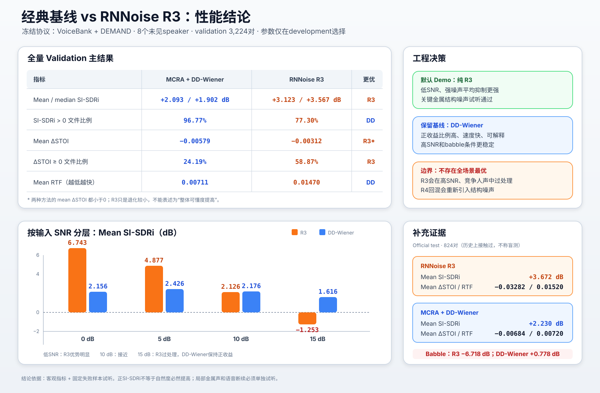

# 基线与 R3 性能、参数说明

最后核验：2026-08-11



## 1. 冻结性能结论

主要证据来自 VoiceBank + DEMAND 的 8-speaker validation，共 3,224 对 16 kHz、单声道、
clean/noisy 对齐音频。参数只在 20-speaker development 上选择，validation 的 speaker 和
utterance 均与 development 不重叠。

| 指标 | MCRA + DD-Wiener | RNNoise R3 | 解释 |
|---|---:|---:|---|
| Mean/median SI-SDRi | `+2.093/+1.902 dB` | `+3.123/+3.567 dB` | R3 平均降噪提升更强 |
| `SI-SDRi > 0` 文件比例 | `96.77%` | `77.30%` | DD-Wiener 更保守、跨文件更稳定 |
| Mean ΔSTOI | `-0.00579` | `-0.00312` | 两者均不能声称整体提高可懂度；R3 退化较小 |
| `ΔSTOI >= 0` 文件比例 | `24.19%` | `58.87%` | R3 有更多文件不降低 STOI |
| Mean RTF | `0.00711` | `0.01470` | 两者均远快于实时；DD-Wiener 约快一倍 |

R3 的 mean SI-SDRi 95% bootstrap CI 为 `[2.925, 3.314] dB`。两个方案均未发现输出
clipping。Official test 824 对上的补充结果为：R3 `+3.672 dB` mean SI-SDRi、
`-0.03282` mean ΔSTOI、`0.01520` RTF；DD-Wiener 分别为 `+2.230 dB`、`-0.00684`、
`0.00720`。该 test set 在历史开发中被接触过，因此不作为完全盲测排名。

### 1.1 条件化结论

| Validation 输入 SNR | R3 mean SI-SDRi | R3 mean ΔSTOI | DD-Wiener mean SI-SDRi |
|---:|---:|---:|---:|
| 0 dB | `+6.743` | `+0.0226` | `+2.156` |
| 5 dB | `+4.877` | `+0.00145` | `+2.426` |
| 10 dB | `+2.126` | `-0.0132` | `+2.176` |
| 15 dB | `-1.253` | `-0.0233` | `+1.616` |

- R3 适合低 SNR、强噪声和关键金属结构噪声；默认 Demo 使用纯 R3。
- DD-Wiener 平均抑制较弱，但在 high-SNR 和 babble 下更稳定，作为经典 fallback/baseline。
- Babble 是 R3 的明确失败条件：R3 `-6.718 dB`，DD-Wiener `+0.778 dB`。
- 目前没有实现自动 high-SNR/babble 切换，因为实时系统拿不到数据集的真值 SNR/noise 标签。
- 不启用 R4 broadband noisy residual mixing；它会恢复部分语音，也会重新引入金属结构噪声。
- C1 3 dB 仅保留为试听消融，未在冻结 validation 上超过纯 R3。

## 2. 评价指标参数

### 2.1 SI-SDR 与 SI-SDRi

```math
\mathrm{SI\!\!\!-\!SDRi}
=\mathrm{SI\!\!\!-\!SDR}(\hat{s},s)
-\mathrm{SI\!\!\!-\!SDR}(y,s)
```

- `s`：clean reference；
- `y`：增强前 noisy input；
- `ŝ`：增强输出；
- 单位为 dB，正值表示相对 noisy input 改善；
- 对固定延迟和时间错位极其敏感；
- 不能完整衡量音色、金属声、pumping 和局部吞字。

### 2.2 Mean / median SI-SDRi

- `mean`：所有文件的算术平均，能表示总体收益，但容易受极端成功/失败样本影响；
- `median`：中位数，更接近典型文件；
- 二者同时报告，可以发现结果分布是否偏斜。

### 2.3 Positive SI-SDRi fraction

`SI-SDRi > 0` 的文件比例。它衡量方案是否稳定地让大多数文件受益。高比例不代表平均提升
一定大：DD-Wiener 是“多数文件小幅改善”，R3 是“低 SNR 文件大幅改善但部分条件退化”。

### 2.4 STOI 与 ΔSTOI

STOI 是 Short-Time Objective Intelligibility，通常位于 `0～1`，用于近似语音可懂度。

```math
\Delta\mathrm{STOI}=\mathrm{STOI}_{enhanced}-\mathrm{STOI}_{noisy}
```

- 正值表示该指标预测可懂度提高；
- 负值表示可能存在语音损伤；
- `ΔSTOI >= 0 fraction` 表示有多少文件没有出现 STOI 退化；
- STOI 不能充分惩罚局部金属声和自然度下降，因此不能越过人工试听门槛。

### 2.5 RTF

```math
\mathrm{RTF}=\frac{\mathrm{processing\ time}}{\mathrm{audio\ duration}}
```

- `RTF < 1`：平均处理速度快于音频到达速度；
- R3 `0.01470`：处理 1 秒音频平均约需 14.70 ms，约为实时速度的 68 倍；
- DD-Wiener `0.00711`：平均约需 7.11 ms，约为实时速度的 141 倍；
- 平均 RTF 不保证每次声卡 callback 都不会因调度抖动而 underrun。

### 2.6 95% bootstrap CI

从文件级结果中重复有放回采样，计算大量均值，再取 2.5% 和 97.5% 分位数。它描述当前数据
协议下 mean SI-SDRi 的统计不确定性，不代表对所有真实麦克风环境的绝对保证。

### 2.7 Clipping

检查 `abs(sample) >= 1.0` 的输出样本数量及 peak。Clipping 会产生不可逆谐波失真；
“无 clipping”只是数值安全条件，不代表音质一定良好。

## 3. MCRA + DD-Wiener 参数

### 3.1 STFT 参数

| 参数 | 冻结值 | 含义 |
|---|---:|---|
| `sample_rate` | `16000` | 经典基线直接在 16 kHz 运行 |
| `frame_length` | `512` | 每次分析 32 ms 波形 |
| `hop_length` | `128` | 每 8 ms 更新一次 |
| `fft_length` | `512` | 得到 257 个非负频率 bin |
| `window` | `sqrt_periodic_hann` | 分析/合成窗组合用于 WOLA 稳定重建 |

### 3.2 MCRA noise PSD 参数

| 参数 | 冻结值 | 增大后的主要影响 |
|---|---:|---|
| `alpha_s` | `0.80` | 功率谱时间平滑更慢、更稳定 |
| `alpha_p` | `0.20` | speech-presence probability 更依赖历史；当前值较小，响应较快 |
| `alpha_d` | `0.95` | noise PSD 更新更慢；语音概率高时进一步接近冻结 |
| `minimum_window_frames` | `125` | 在更长历史中找局部谱最小值；当前约 1 秒 |
| `ratio_threshold` | `5.0` | 更难把能量上升判为 speech presence，noise estimator 更新更激进 |
| `epsilon` | `1e-12` | 防止除零和对数数值错误，不是声学调节量 |

MCRA 使用平滑功率谱与局部最小值之比：

```math
R(k,m)=\frac{S(k,m)}{S_{min}(k,m)}
```

`R > ratio_threshold` 时更倾向判断为 speech presence。持续结构噪声可能长期保持高能和谱
结构，因此被错误保护成语音，这是经典路线的主要失败点。

### 3.3 Decision-Directed Wiener 参数

| 参数 | 冻结值 | 含义 |
|---|---:|---|
| `alpha_dd` | `0.92` | priori SNR 中历史估计占 92%，当前瞬时估计占 8% |
| `gain_floor` | `0.20` | 频谱幅度增益最低为 0.20，最大衰减约 14 dB |
| `gain_decrease_smoothing` | `0.70` | gain 下降时较慢，减少突然挖空频谱 |
| `gain_increase_smoothing` | `0.40` | gain 恢复时较快，保护语音起音和尾音 |
| `maximum_snr` | `1e4` | 数值上限制 SNR，避免极端除法结果 |

Decision-directed priori SNR：

```math
\xi_t=\alpha_{dd}G_{t-1}^{2}\gamma_{t-1}
+(1-\alpha_{dd})\max(\gamma_t-1,0)
```

`alpha_dd` 越大，gain 越平稳，但快速噪声变化响应越慢，历史错误也可能持续。`gain_floor`
越低，抑制越强，同时吞字、金属感和频谱空洞风险越高。最终选择 0.20 而不是开发集均值略高
的 0.10，是为了减少负收益文件并保持保守抑制。

`speech_absence_prior_min/max`、`vad_prior_strength` 主要服务 Dual-Uncertainty/OM-LSA 等概率
感知消融，不是当前基础 DD-Wiener 冻结结论的决定参数。

## 4. RNNoise R3 参数

### 4.1 声学和网络参数

| 参数 | 数值 | 含义 |
|---|---:|---|
| `sample_rate` | `48000 Hz` | 官方 RNNoise 固定运行采样率 |
| `frame_samples` | `480` | 每 10 ms 输入一次新帧 |
| `analysis_window` | `960` | 历史 480 点 + 当前 480 点，20 ms 分析窗 |
| `fft_bins` | `481` | 960 点 real FFT 的非负频率 bin |
| `erb_bands` | `32` | 按听觉分辨率聚合频谱 |
| `input_features` | `65` | 32谱包络cepstrum + 32 pitch相关cepstrum + 1 pitch period |
| `Conv1D 1` | `65→128` | 因果短期特征建模，保存两帧历史输入 |
| `Conv1D 2` | `128→384` | 形成更高维局部时序表示 |
| `GRU` | `3层×384` | 通过 persistent hidden state 建模跨帧语音/噪声模式 |
| `concatenation` | `1536` | 拼接 Conv2 与三层 GRU 输出 |
| `gain head` | `32` | 每个 ERB band 一个 `[0,1]` 连续增益 |
| `VAD head` | `1` | 辅助 speech probability，不直接 hard mute 音频 |

这些参数与预训练权重来自固定的官方 RNNoise 版本，本项目没有训练或重新选择网络层数。
项目贡献集中在流式适配、状态管理、重采样、延迟对齐、控制器消融和完整评价。

### 4.2 重采样与实时参数

| 参数 | 数值 | 含义 |
|---|---:|---|
| 上/下采样比例 | `3` | 16 kHz 与 48 kHz 之间转换 |
| FIR taps | `127` | 抗镜像/抗混叠滤波器长度 |
| cutoff | `7800 Hz` | 略低于 8 kHz Nyquist，为实际过渡带留空间 |
| Kaiser `beta` | `8.6` | 主瓣宽度和旁瓣衰减的折中 |
| RNNoise core delay | `160 samples @16k` | 一帧，即 10 ms |
| 两段 FIR delay | `42 samples @16k` | 2.625 ms |
| 完整固定延迟 | `202 samples @16k` | 12.625 ms；离线评价必须补偿 |
| `chunk_size_16k` | `137` | 任意 chunk 能力的非整帧压力测试值，不是模型帧长 |

`persistent DenoiseState` 不是可调超参数，而是算法正确性要求。它保存 Conv/GRU、pitch、
analysis/synthesis overlap、delayed spectrum 和上一帧 gain 等历史。每个 chunk 或每帧重建
state 都会改变算法输出。

## 5. 最终选择

- 默认展示和真实麦克风 Demo：`R3 official pretrained RNNoise`；
- 经典对照和潜在保守 fallback：`MCRA + DD-Wiener`；
- 不启用 R4 broadband residual mixing；
- C1 3 dB 只作断续感试听消融；
- 当前不能声称 R3 全场景最优，也不能声称整体 STOI 提高；
- 下一步有价值的方向是使用运行时可获得的 SNR/noise confidence 做保守旁路，而不是使用
  数据集真值标签构造 oracle controller。

数字来源：[`06_结果与结论说明.md`](06_结果与结论说明.md)。实验路线和失败证据：
[`05_实验路线与失败分析.md`](05_实验路线与失败分析.md)。冻结参数：
[`configs/full_protocol.json`](../../configs/full_protocol.json)。
