# 普通话混响鲁棒 ASR：论文式实验结果与结论

最后更新：2026-08-29

## 摘要

本项目研究普通话远场混响中的自动语音识别。实验使用 AISHELL-1、可控四麦
Pyroomacoustics RIR、Whisper-small 和冻结 Paraformer，将系统拆分为 Raw 输入、
单/多通道 WPE、普通话 Clean-LoRA 领域适配与 RIR 多条件训练（MCT）。通过
speaker/room 双隔离、1,000 条 Whisper 封存测试、500 条 Paraformer 独立复核和
10,000 次 paired bootstrap，得到三项主要结论：

1. Raw CER 随 RT60 显著上升，DRR 能解释同 RT60 内的部分差异；
2. 多通道 M-WPE 能显著降低中重度混响 CER，但不适合对 clean/轻度混响无条件常开；
3. LoRA 的大部分基础收益来自普通话领域适配。MCT 在 Raw 上有独立收益，但在
   M-WPE 之后的额外收益不再显著，表明两者对混响失真的处理高度重叠。

## 1. 实验协议

| 模块 | 冻结设置 |
|---|---|
| 语音 | AISHELL-1；20 h 训练子集，500 条 `dev_frontend`，1,000 条 `dev_model`，1,000 条封存 test |
| RIR | 四麦 5 cm 半径 UCA；RT60=`0.2/0.4/0.6/0.8/1.0 s`；train/dev/test 为 `1000/200/300` 组 |
| 隔离 | AISHELL 官方 speaker 隔离；100/20/20 个 train/dev/test 房间；test 为 60 个同几何 RT60 family |
| 前端 | Raw、S-WPE-10、S-WPE-40、M-WPE-10；dev 选型后只将 Raw/M-WPE-10 送入 test |
| Whisper | W0 pretrained、Clean-LoRA、MCT-LoRA；LoRA 为 encoder+decoder Q/V、`r=8` |
| MCT | 与 Clean-LoRA 相同的 20 h、optimizer steps 和 3 epoch；每 epoch 50% clean/50% raw reverb |
| 统计 | 中文规范化 corpus CER、S/D/I、10,000 次 paired bootstrap，seed=2026 |

本文定义 `Robust=RT60 0.4–1.0 s`，`Heavy=RT60 0.8–1.0 s`。test 不参与前端、
LoRA 位置、checkpoint 或超参选择。

## 2. 实验结果

### 2.1 可控 RIR 确实形成预期的衰减差异

同一 test geometry 的三个 RIR 实测如下。

| 目标 RT60 | 实测 RT60 | 参考通道 DRR |
|---:|---:|---:|
| 0.2 s | 0.17 s | -5.4 dB |
| 0.6 s | 0.63 s | -9.4 dB |
| 1.0 s | 1.09 s | -11.3 dB |

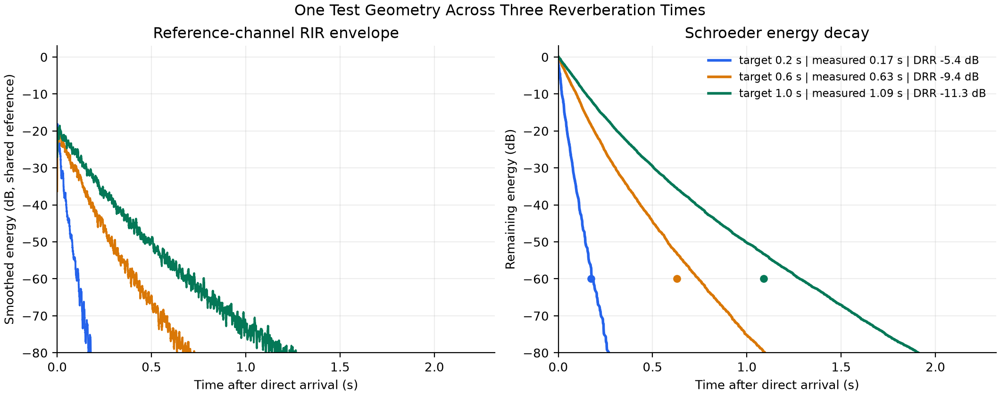

*图 1：同一几何只改变目标 RT60。实测 `-60 dB` 衰减位置与目标接近；RT60
增大时能量尾部延长，该样例的 DRR 同时降低。*

**结论 1。** RIR bank 不是只在 manifest 中填入 RT60 标签，而是在波形衰减上实现了
可测量的条件差异。该图是一个受控样例；整个 test bank 还经过文件哈希、有限值、
shape、RT60 容差、DRR 重算与 room/geometry 隔离联合校验。

### 2.2 RT60 增大会填充语音间隙并延长拖尾

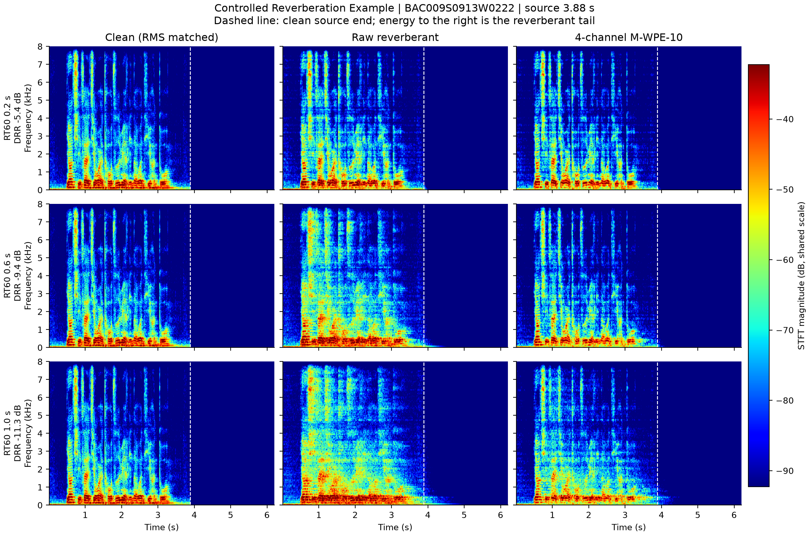

*图 2：同一语句和同一 RIR family，只改变 RT60。所有子图共用 `[-100,-25] dB`
色标，Raw/WPE 没有分别归一化。*

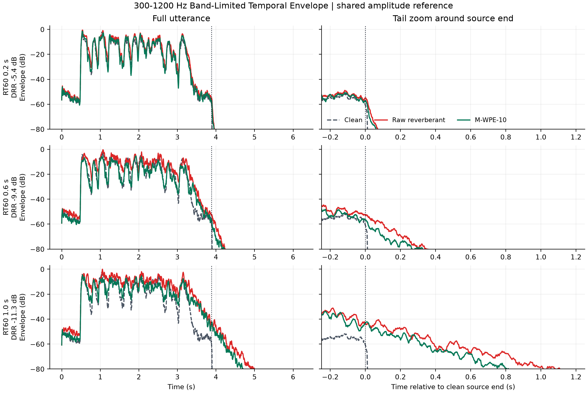

*图 3：四阶 Butterworth 带通、Hilbert 包络和 20 ms 平滑，纵轴延伸到 `-120 dB`。
RT60=1.0 s 时，声源结束约 0.4 s 后 M-WPE 带内残响大致低于 Raw `5–15 dB`。*

**结论 2。** RT60 增大时，Raw 的音节边界和频谱间隙被横向尾部填充；M-WPE
能恢复部分间隙，但不能把波形还原成 clean。`300–1200 Hz` 包含该片段
80–8000 Hz 能量的 `50.83%`，是用来显示拖尾的代表子带，不是完整“人声频带”。

### 2.3 Raw CER 随 RT60 单调恶化，M-WPE 压缩了退化斜率

| RT60 | W0 Raw CER | W0 M-WPE CER | M-WPE−Raw | 95% CI |
|---:|---:|---:|---:|---:|
| 0.2 s | 14.82% | 13.60% | -1.22 pp | `[-1.58,-0.85]` pp |
| 0.4 s | 17.34% | 14.13% | -3.21 pp | `[-3.77,-2.63]` pp |
| 0.6 s | 20.57% | 14.66% | -5.91 pp | `[-6.65,-5.21]` pp |
| 0.8 s | 26.50% | 15.58% | -10.92 pp | `[-13.28,-9.28]` pp |
| 1.0 s | 30.04% | 17.20% | -12.84 pp | `[-13.91,-11.79]` pp |

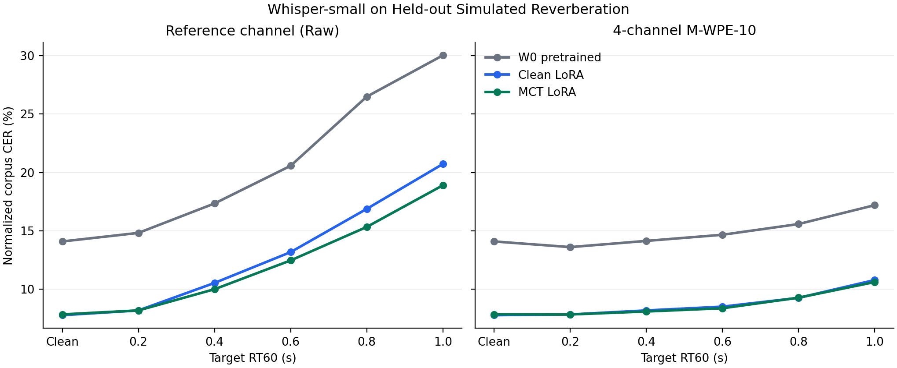

*图 4：1,000 条封存 test。左图为 Raw，右图为四通道 M-WPE-10；三条曲线分别为
W0、Clean-LoRA 和 MCT-LoRA。*

**结论 3。** W0 Raw CER 从 `14.82%` 单调增长到 `30.04%`，证明混响是
可控且显著的 ASR 退化因素。M-WPE 后只增长到 `17.20%`，而且五档收益区间都低于
0；混响越重，去混响的绝对 CER 收益越大。

### 2.4 RT60 不能唯一决定难度，DRR 解释同档内的部分差异

| 固定 RT60 | RIR family 数 | DRR–CER 退化 Spearman ρ |
|---:|---:|---:|
| 0.6 s | 60 | -0.406 |
| 0.8 s | 60 | -0.419 |
| 1.0 s | 60 | -0.455 |

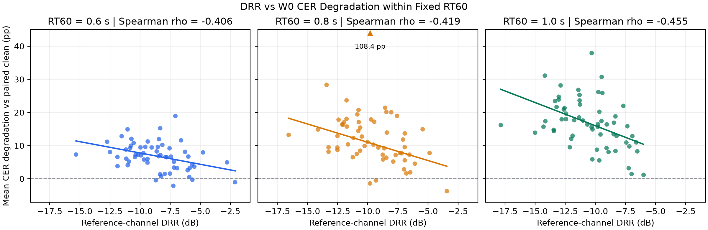

*图 5：每个点是一个 test RIR family 上各语句的平均 CER 退化。RT60=0.8 s 的
`108.4 pp` 离群点未删除，只在图边界标记。*

**结论 4。** 在 RT60 已固定时，DRR 越低、直达声相对越弱，平均 CER 退化
通常越大。但散点仍有明显离散，因此 DRR 是次级解释变量，不是完整因果模型；
距离只保留为场景几何元数据。

### 2.5 多通道 WPE 显著优于单通道 WPE

| RT60 | Raw | S-WPE-10 | S-WPE-40 | M-WPE-10 |
|---:|---:|---:|---:|---:|
| 0.2 s | 13.56% | 13.22% | 13.12% | **12.89%** |
| 0.4 s | 15.30% | 16.31% | 15.86% | **12.86%** |
| 0.6 s | 18.78% | 16.86% | 15.58% | **13.40%** |
| 0.8 s | 21.04% | 19.01% | 17.34% | **13.95%** |
| 1.0 s | 27.36% | 22.84% | 20.30% | **15.71%** |

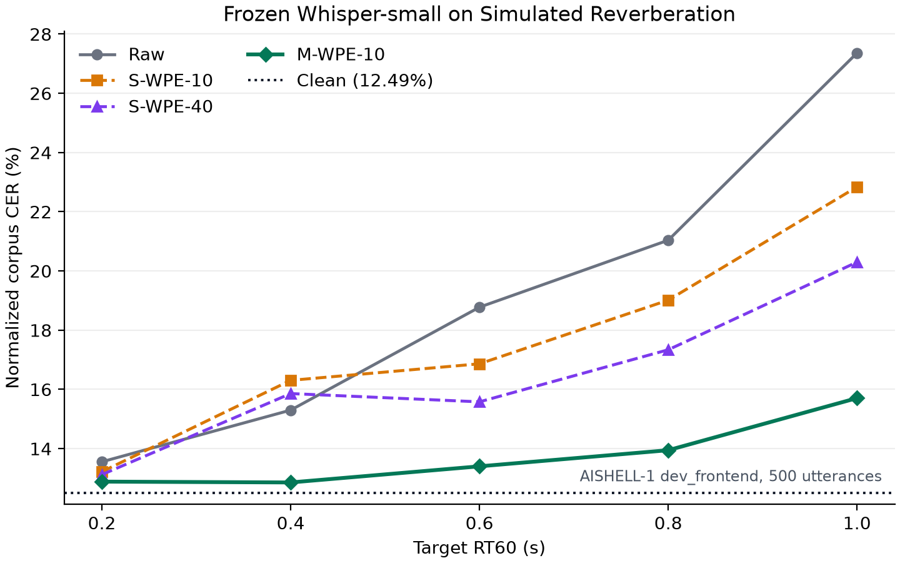

*图 6：冻结 Whisper-small、500 条 `dev_frontend`。虚线为 clean CER `12.49%`。*

**结论 5。** S-WPE-40 在中重度混响下通常优于 S-WPE-10，说明更长的时间预测
有价值；但 M-WPE-10 从 RT60=0.4 s 起又显著优于两种单通道方案，说明空间观测
仍提供额外信息。因此冻结 M-WPE-10 进入正式 test，不再用 test 搜索 delay/taps。

### 2.6 信号指标与 CER 整体同向，但不能替代 ASR 指标

| RT60 | M-WPE ΔSI-SDR | M-WPE ΔSTOI | M-WPE ΔCER |
|---:|---:|---:|---:|
| 0.2 s | +1.09 dB | +0.027 | -0.67 pp |
| 0.4 s | +2.59 dB | +0.102 | -2.44 pp |
| 0.6 s | +3.90 dB | +0.166 | -5.37 pp |
| 0.8 s | +4.35 dB | +0.182 | -7.09 pp |
| 1.0 s | +4.28 dB | +0.190 | -11.66 pp |

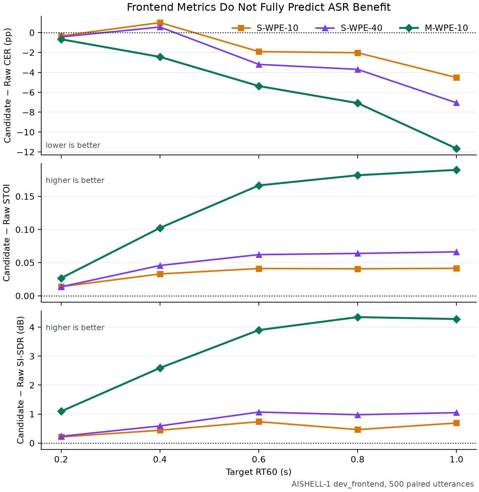

*图 7：上图负值表示 CER 降低，中下图正值表示 STOI/SI-SDR 改善。*

**结论 6。** M-WPE 的三类收益总体随混响加重而扩大，支持“前端确实抑制了晚期
混响”。但在 RT60=0.4 s，S-WPE-10/40 的 SI-SDR 和 STOI 都改善，CER 却从
`15.30%` 恶化为 `16.31%/15.86%`。因此前端选型必须以 CER/WER 为最终依据。

### 2.7 WPE 不能作为 clean 和无晚期混响输入的常开前端

| 条件 | CER | 插入错误 | 相对 direct raw 的 95% CI |
|---|---:|---:|---:|
| Direct raw | 12.75% | 26 | — |
| Direct S-WPE-10 | 12.47% | 23 | `[-0.62,+0.05]` pp |
| Direct S-WPE-40 | 14.02% | 126 | `[-0.53,+4.54]` pp |
| Direct M-WPE-10 | 14.07% | 125 | `[-0.45,+4.56]` pp |

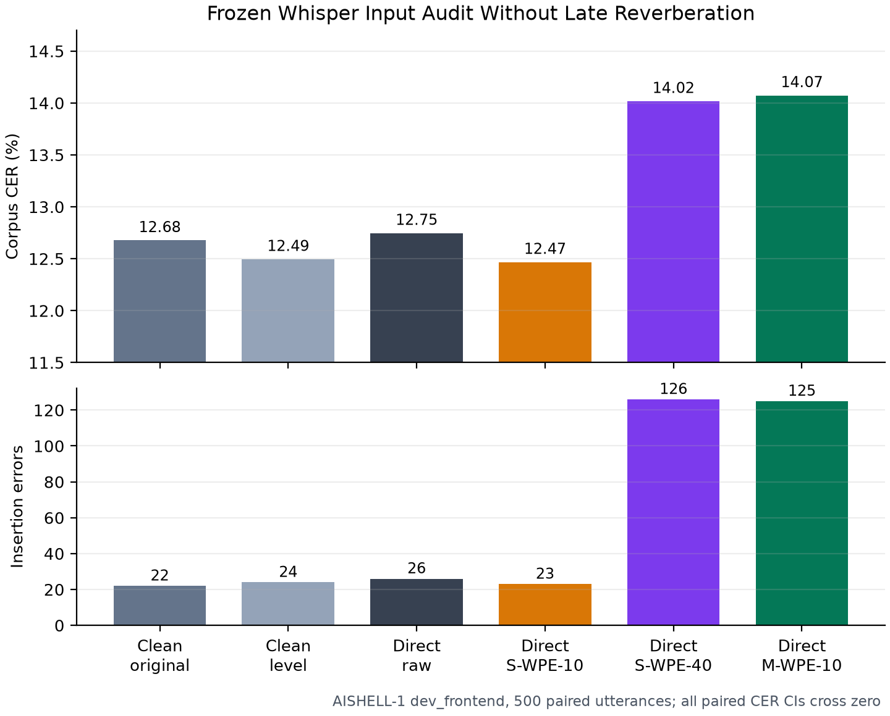

*图 8：500 条配对语句。上图是 CER，下图是插入错误数；所有配对 CER 区间均跨 0。*

**结论 7。** 无法证明任一 WPE 在 direct-only 上有统计收益。M-WPE-10 和
S-WPE-40 的点估计反而恶化约 `1.2–1.3 pp`，并伴随插入错误明显增加。因此 clean
直接送入 ASR，M-WPE-10 只对已知四通道混响输入启用。

### 2.8 LoRA 位置、MCT 开发集收益与 Paraformer 复核

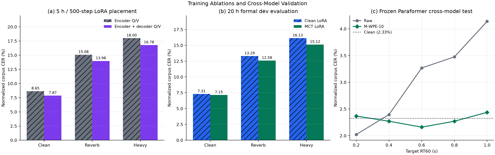

*图 9：(a) 5 h/500-step LoRA 位置消融；(b) 20 h 正式训练的 dev 最佳 checkpoint；
(c) 500 条冻结 Paraformer 封存 test。*

**结论 8a。** 短程消融中，encoder+decoder Q/V 相对 encoder Q/V 将 Reverb CER 从
`15.08%` 降至 `13.98%`，Heavy 从 `18.00%` 降至 `16.78%`，因此用于正式训练。
但其可训参数为 `0.365% vs 0.122%`，不是等参数层位对照，只能说明“当前预算下加入
decoder 适配有用”。

**结论 8b。** 正式 dev 上，MCT 相对 Clean-LoRA 将 Reverb CER 从 `13.29%` 降到
`12.58%`，Heavy 从 `16.13%` 降到 `15.12%`，且 clean 没有明显代价。两个
checkpoint 都在进入 test 前锁定为 epoch 3。

**结论 8c。** Paraformer 在 RT60=0.2 s 时 M-WPE 点估计恶化，0.4 s 无显著差异，
`RT60>=0.6 s` 时均显著改善。这提前表明 WPE 的适用性与混响强度有关，不是所有
输入常开的通用增益器。

### 2.9 普通话适配是 LoRA 的主要基础收益，MCT 在 Raw 上还有独立收益

| 模型 | Clean | Robust Raw | Robust M-WPE | Heavy Raw | Heavy M-WPE |
|---|---:|---:|---:|---:|---:|
| W0 | 14.08% | 23.61% | 15.39% | 28.27% | 16.39% |
| Clean-LoRA | **7.76%** | 15.33% | 9.18% | 18.80% | 10.02% |
| MCT-LoRA | 7.83% | **14.17%** | **9.08%** | **17.11%** | **9.94%** |

**结论 9a。** W0→Clean-LoRA 将 clean CER 从 `14.08%` 降到 `7.76%`，证明 W0→MCT 的大幅
改善不能全部归因于混响增强；大部分基础收益来自普通话、AISHELL 录音域与标注/解码
形式适配。Clean-LoRA 是分离混响增强贡献所必需的对照组。

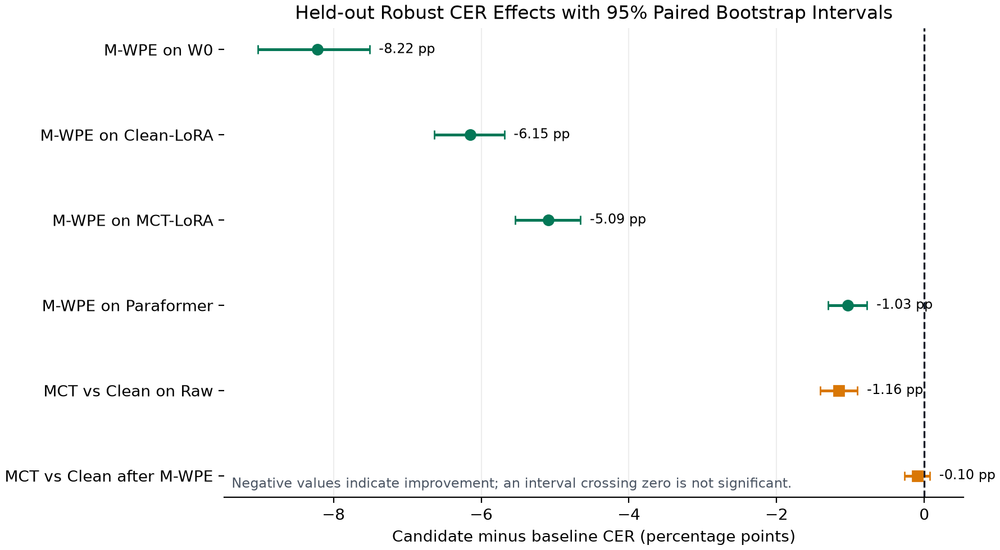

*图 10：负值表示改善；区间跨过 0 表示当前 test 无法证明额外收益。*

**结论 9b。** Raw 上 MCT−Clean 为 `-1.16 pp`，95% CI=`[-1.41,-0.90] pp`，证明
相同训练预算下 MCT 有独立混响收益；Clean CER 为 `7.83% vs 7.76%`，没有明显
clean 代价的点估计证据。

**结论 9c。** 加入 M-WPE 后，MCT−Clean 只剩 `-0.10 pp`，95% CI=`[-0.27,+0.07] pp`，
区间跨 0。MCT 不是无效，而是 WPE 已先移除大量 MCT 在训练中适配的可预测晚期混响，
两者收益高度重叠。

### 2.10 WPE 的收益不只是替换错误下降

| RT60=1.0 s，W0 | 替换 S | 删除 D | 插入 I | CER |
|---|---:|---:|---:|---:|
| Raw | 3911 | 190 | 243 | 30.04% |
| M-WPE | 2266 | 139 | 82 | 17.20% |

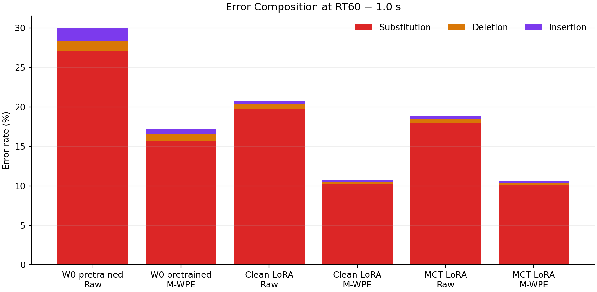

*图 11：红/橙/紫分别表示替换、删除和插入错误率。*

**结论 10。** 在最重混响下，M-WPE 将 W0 替换减少 `1645`、删除减少 `51`、
插入减少 `161`。这说明它不只使声学 token 更容易区分，也明显抑制了长拖尾导致的
幻觉式插入。

### 2.11 Paraformer 证明中重度 WPE 收益不是 Whisper 中文较弱造成的假象

| RT60 | Paraformer Raw | Paraformer M-WPE | 差值 | 95% CI |
|---:|---:|---:|---:|---:|
| 0.2 s | 2.02% | 2.37% | +0.35 pp | `[0.00,+0.74]` pp |
| 0.4 s | 2.40% | 2.27% | -0.12 pp | `[-0.48,+0.24]` pp |
| 0.6 s | 3.27% | 2.16% | -1.11 pp | `[-1.58,-0.64]` pp |
| 0.8 s | 3.48% | 2.27% | -1.20 pp | `[-1.62,-0.81]` pp |
| 1.0 s | 4.14% | 2.44% | -1.70 pp | `[-2.21,-1.22]` pp |

Paraformer Robust 从 `3.32%` 降到 `2.28%`，差值 `-1.03 pp`，95% CI=
`[-1.30,-0.78] pp`，相对降低 `31.2%`；Heavy 从 `3.81%` 降到 `2.35%`。该结果
同时对应图 9(c) 的分档曲线和图 10 的 Robust 区间。

**结论 11。** Paraformer clean CER 为 `2.33%`，明显强于 Whisper W0 的 `14.08%`；但
M-WPE 仍在 `RT60>=0.6 s` 的三档全部显著有效。因此中重度 WPE 收益可跨不同
ASR 架构复现，不能归因于 Whisper 中文基线偏弱。MCT 没有微调 Paraformer，所以
“MCT 跨模型有效”仍不在当前结论范围内。

## 3. 敏感性分析与误差解释

### 3.1 解码策略不改变前端结论

| 100 条子集 | Greedy | Beam-5 | Beam−Greedy 95% CI |
|---|---:|---:|---:|
| Clean | 12.06% | 10.62% | `[-2.49,-0.56]` pp |
| RT60=0.8 Raw | 19.31% | 18.74% | `[-1.93,+0.71]` pp |
| RT60=0.8 M-WPE | 13.85% | 12.92% | `[-2.14,+0.22]` pp |

Beam-5 在 clean 上显著改善，在两个混响条件上区间跨 0；Beam-5 下 M-WPE−Raw
仍为 `-5.82 pp`，95% CI=`[-8.02,-3.62] pp`。因此主实验统一使用 greedy 不会
改变“WPE 有效”的方向。

### 3.2 Whisper clean CER 有一部分来自数字书写形式

| 评分 | Clean CER |
|---|---:|
| 预注册正式 CER | 12.49% |
| 逐句数字等价诊断下界 | 9.45% |

500 条 clean 中有 76 条 hypothesis 含阿拉伯数字，75 条在诊断重评分中减少错误。
`3.04 pp` 差值说明 Whisper 的部分 clean 错误是“四点八”与“4.8”的书写形式差异，
不是纯声学失败。该指标使用逐句最优数字读法，只是诊断下界，不替代正式 CER；
各条件的相对排序不变。

## 4. 结论综合

### 4.1 方法之间的关系

1. **普通话领域适配与 WPE 互补。** W0+WPE 的 Robust CER 为 `15.39%`，几乎等于
   Clean-LoRA+Raw 的 `15.33%`；两者组合后达到 `9.18%`。
2. **MCT 与 WPE 高度重叠。** MCT 在 Raw 上显著改善 `1.16 pp`，在 WPE 后只有
   `0.10 pp` 且区间跨 0。
3. **多通道前端与单通道模型鲁棒化是两条受输入条件约束的路线。** 有四通道时可用
   WPE；只有单通道时 MCT 是不增加推理前端的有效方案。

### 4.2 条件式系统选择

| 输入条件 | 实验支持的选择 | 根据 |
|---|---|---|
| clean/轻度混响 | 旁路 WPE | direct-only 无收益证据；Paraformer RT60=0.2 s 点估计恶化 |
| 单通道中重度混响 | MCT-LoRA | Raw 上相对 Clean-LoRA 显著改善 `1.16 pp` |
| 同步四通道中重度混响 | M-WPE-10 + Clean-LoRA | `15.33%→9.18%`；MCT 在 WPE 后没有可证明的额外收益 |
| 只追求当前普通话绝对 CER | Paraformer 作为更强基线 | clean `2.33%` vs Whisper W0 `14.08%` |

## 5. 结论边界

- test 使用可控仿真 RIR，尚未用同步多通道实测 RIR 验证 sim-to-real。
- 当前没有加性背景噪声，不把结论扩展为“混响+噪声鲁棒 ASR”。
- WPE 已跨 Whisper/Paraformer 验证；MCT 只在 Whisper-LoRA 上验证。
- 项目不研究流式、量化、端侧延迟或部署，不将离线结果包装成实时系统。
- 水下到达角—多普勒 STAP/MVDR 与语音 WPE 不是同一算法；两者的联系是多通道统计
  建模和自适应滤波的方法论。

## 6. 新增图的复现入口

```bash
python scripts/robust_asr/plot_training_cross_model.py \
  --encoder-eval "$ROBUST_ASR_DATA_ROOT/runs/pilot_mct_5h_encoder_qv_500step_v1/eval_metrics.jsonl" \
  --encoder-decoder-eval "$ROBUST_ASR_DATA_ROOT/runs/pilot_mct_5h_encoder_decoder_qv_500step_v1/eval_metrics.jsonl" \
  --clean-eval "$ROBUST_ASR_DATA_ROOT/runs/formal_clean_lora_20h_encoder_decoder_qv_v1/eval_metrics.jsonl" \
  --mct-eval "$ROBUST_ASR_DATA_ROOT/runs/formal_mct_lora_20h_encoder_decoder_qv_v1/eval_metrics.jsonl" \
  --paraformer-summary \
    "$ROBUST_ASR_DATA_ROOT/outputs/frozen_paraformer_test_reverb_test_500utt_raw_mwpe_v1.summary.json" \
  --output docs/figures/robust_asr_training_cross_model.png
```

其他图的数据源、生成命令和统计边界见[执行记录](01_执行记录与复现.md)与
[可视化分析](04_可视化分析.md)。
